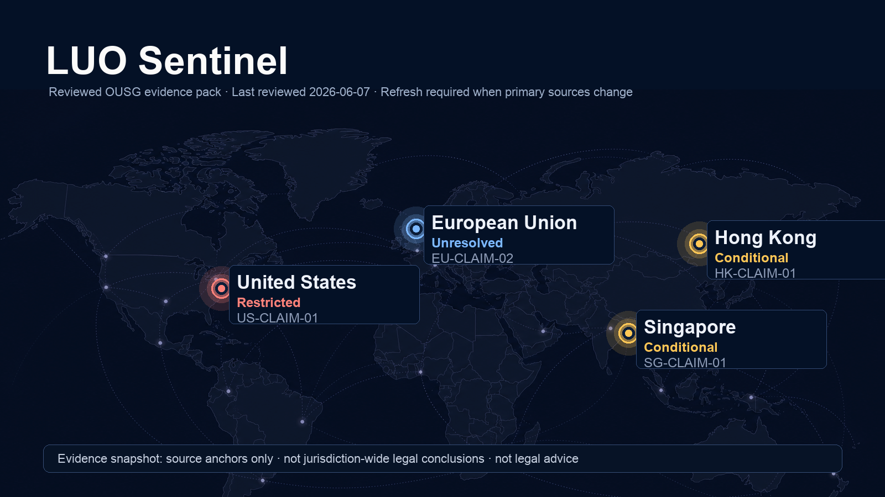

# LUO Sentinel

> 面向 RWA 合规工作流的 evidence-bound AI handoff demo。

<p align="center">
  
</p>

<p align="center">
  <a href="README.md">English</a> ·
  <a href="https://luo-sentinel.vercel.app">Live Demo</a> ·
  <a href="docs/ONCHAIN_RECEIPT_SPEC.md">Receipt Spec</a> ·
  <a href="docs/PITCH_DECK.md">Pitch Deck Outline</a>
</p>

<p align="center">
  
  
  
  
  
</p>

LUO Sentinel 是一个面向 RWA 合规工作流的 AI agent trust layer demo。它把经过审核的监管 source anchors 组织成可视化 evidence map，并在任何下游 agent 行动前加入 scope review、human gate 和可验证 receipt。

本项目的重点不是让 AI 直接给出“某地可以发行/转让”的法律结论，而是展示一条更安全的链路：先确认资料来源和适用边界，再决定 AI 被允许做什么。

地图不是实时法律结论，而是 reviewed evidence pack 的当前快照。监管来源变化后，相关 signal 必须重新审核。

## Evidence Map Screenshot

<p align="center">
  
</p>

## Demo

## 项目简介

LUO Sentinel 展示了一个 AI x Web3 合规工作流的最小闭环：

1. 用户提出 RWA 合规问题。
2. 系统只允许进入已审核的 evidence scope。
3. 地图展示不同司法辖区的 source anchors 和风险边界。
4. Review Council 检查 source 是否被过度解释。
5. Human gate 决定是否 Proceed。
6. Proceed receipt 可以被锚定到 testnet。
7. Downstream agent 只能在批准范围内生成律师准备清单。

## 核心特性

- **Reviewed evidence map**  
  地图来自已审核的 source anchors，不是 LLM 现场生成的法律判断。

- **Cross-border / single-jurisdiction scope**  
  可以保留 US、Hong Kong、Singapore、EU 的差异，也可以缩小到 Hong Kong-only。

- **Agent Review Council**  
  三个 reviewer 检查 scope、source fit、claim support 和 action risk。分数是审核权重，不是 LLM confidence。

- **Human-gated receipt**  
  Proceed receipt 绑定 evidence hash、product reference hash、reviewer wallet 和 timestamp。

- **Zero-value testnet anchoring**  
  钱包真实确认合约部署和 receipt anchor，但不移动资产。

- **Bounded downstream agent**  
  下游 agent 只能基于已批准范围生成 counsel-preparation checklist。

## Evidence Map 是怎么来的

当前 demo map 来自一个 reviewed OUSG sample evidence pack，最后审核日期为 `2026-06-07`。

每个 jurisdiction signal 包含：

- source anchor；
- signal status，例如 Restricted、Conditional、Unresolved；
- source 支持什么；
- source 不能推出什么。

在生产环境中，evidence layer 可以连接监管官网、官方法律数据库或可信 MCP connector。LLM 可以帮助抽取 candidate claims，但只有经过专家或人工验证后，claim 才能成为 map signal。监管来源变化时，旧 signal 应标记为 stale 并重新审核。

## 技术栈

| 层 | 技术 |
| --- | --- |
| Frontend | React, Vite, CSS |
| Wallet / Testnet | ethers.js, MetaMask-compatible wallet |
| Smart Contract | Solidity, Foundry |
| Deployment | Vercel |

## 快速开始

```bash
git clone https://github.com/alexfanzong/luo-sentinel.git
cd luo-sentinel/app
npm install --ignore-scripts
npm run dev
```

运行测试：

```bash
npm test
```

生产构建：

```bash
npm run build
```

## 项目结构

```text
.
├── app/
│   ├── public/                  # Logo and map assets
│   ├── src/
│   │   ├── lib/                 # Evidence, receipts, review council, wallet helpers
│   │   ├── App.jsx              # Main demo flow
│   │   └── styles.css           # UI styles
│   └── package.json
├── contracts/
│   └── LUOReceiptAnchor.sol     # Receipt-anchor contract
├── docs/
│   ├── DEMO_SCRIPT.md
│   ├── INJECTIVE_INTEGRATION.md
│   ├── ONCHAIN_RECEIPT_SPEC.md
│   └── PITCH_DECK.md
├── test/
│   └── LUOReceiptAnchor.t.sol
└── vercel.json
```

## 非法律意见

LUO Sentinel 是研究和演示项目。它不提供法律意见、法律结论、合规判断、投资建议，也不授权任何 tokenized asset 的发行、要约、销售、转让、托管或营销。

Evidence map 和 agent handoff 的目的，是保留 source boundary，并把问题整理给合格专业人士审核。它不能替代持牌律师或受监管合规专业人士的意见。

## 安全边界

LUO Sentinel 不会：

- 移动资产；
- 给出法律结论；
- 建立合规结论；
- 授权 token 发行或转让；
- 将私钥、助记词或法律文本上传链上。

链上只锚定：

- receipt hash；
- evidence manifest hash；
- product reference hash；
- reviewer wallet；
- decision timestamp。

链下保留 legal source text、action-plan narrative、reviewer scorecards、downstream handoff brief 和 counsel-preparation checklist。

## 作者介绍

Built by Alex Fan。长期关注 AI、Web3 与跨境法律/合规基础设施的交叉方向，重点是 building programmable compliance systems for agentic workflows。

## 产品路线图

### 1. Evidence Infrastructure

- 连接监管官网、官方法律数据库或可信 MCP connector。
- 增加 source-change detection、stale-signal 标记和 re-review workflow。
- 从 OUSG sample 扩展到可复用的 RWA evidence graph。

### 2. Agent Review Layer

- 用 live LLM/legal reviewer agents 替换 deterministic demo reviewers。
- 记录 reviewer reputation、evaluation records 和 disagreement history。
- 支持 source fit、jurisdiction scope、claim support 和 action risk 的多 agent 审核。

### 3. Handoff And Receipt Protocol

- 标准化 downstream agents 可读取的 machine-readable handoff 格式。
- 增加 receipt verification endpoint 和更适合 explorer 展示的 receipt view。
- 支持 human-approved scope 之后的 policy-controlled agent execution。

### 4. Productization

- 为团队、律师和合规 reviewer 增加 workspace 功能。
- 增加 case history、audit trail 和 evidence refresh notification。
- 支持 legal、compliance 和 RWA operations teams 的企业部署模式。

## 开源协议

源代码采用 Apache License 2.0。详见 [LICENSE](LICENSE)。

LUO Sentinel 的名称、logo、demo evidence pack、监管来源摘要和合规流程叙事仅用于黑客松展示，不构成法律、合规、商标或商业背书授权。
