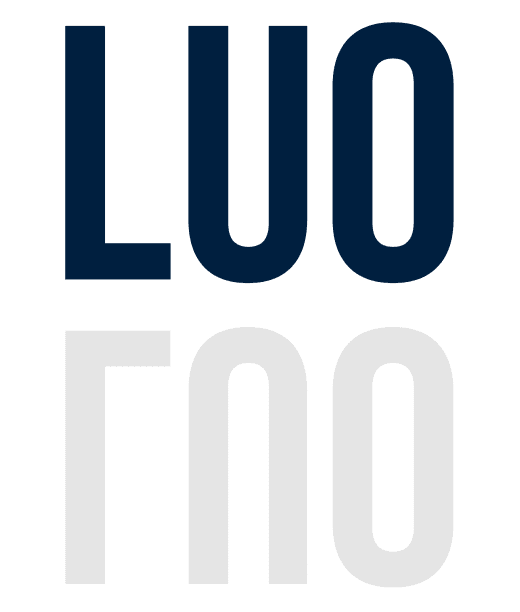

# LUO Sentinel

> 面向 Injective RWA 动作的证据约束型 AI Sentinel。

<p align="center">
  
</p>

<p align="center">
  <a href="README.md">英文</a> ·
  <a href="https://luo-sentinel.vercel.app">在线演示</a>
</p>

<p align="center">
  
  
  
  
  
</p>

LUO Sentinel 是一个面向 Injective RWA 动作的证据约束型守卫层。它把经过审核的监管来源锚点组织成可视化证据地图，并在任何下游 Agent 行动前加入 Sentinel 评审、人工关口和可验证回执。

本项目的重点不是让 AI 直接给出“某地可以发行/转让”的法律结论，而是展示一条更安全的链路：先拦住动作，确认资料来源和适用边界，再决定 AI 被允许做什么。

地图不是实时法律结论，而是已审核证据包的当前快照。监管来源变化后，相关信号必须重新审核。

## 证据地图截图

<p align="center">
  
</p>

## 演示

在线演示：[https://luo-sentinel.vercel.app](https://luo-sentinel.vercel.app)

建议评委这样看：

1. 在空白搜索框输入跨辖区问题：
   `We're launching a tokenized US Treasury (OUSG) product, where can we legally offer and transfer it?`
2. 打开地图上的司法辖区标记，检查每个信号是否跳转到对应来源锚点。
3. 依次走完行动计划、Agent 评审、人工关口、测试网锚定和交接。
4. 运行有边界的下游 Agent，确认它生成的是律师准备清单，而不是法律结论。
5. 重新开始，输入仅限香港的问题：
   `Can we launch OUSG in Hong Kong only?`
6. 确认地图缩小到香港来源范围，并且不会推断美国、新加坡或欧盟覆盖范围。

## 项目简介

LUO Sentinel 展示了一个 AI x Web3 Sentinel 工作流的最小闭环：

1. 一个 RWA 动作在执行前被拦住。
2. 系统只允许它进入已审核的证据范围。
3. 地图展示不同司法辖区的来源锚点和风险边界。
4. 评审委员会检查来源是否被过度解释。
5. 人工关口决定是否放行。
6. 有边界的 Sentinel 回执可以被锚定到测试网。
7. 下游 Agent 只能在批准范围内生成律师准备清单。

## 核心特性

- **已审核证据地图**  
  地图来自已审核的来源锚点，不是 LLM 现场生成的法律判断。

- **跨境 / 单一司法辖区范围**  
  可以保留美国、香港、新加坡、欧盟的差异，也可以缩小到仅限香港。

- **Agent 评审委员会**  
  三个评审者检查范围、来源匹配度、主张支持度和行动风险。分数是审核权重，不是模型置信度。

- **人工关口回执**  
  Sentinel 回执为已批准的证据范围生成审核钱包决策记录。

- **零金额测试网锚定**  
  钱包真实确认合约部署和回执锚定，但不移动资产。

- **有边界的下游 Agent**  
  下游 Agent 只能基于已批准范围生成律师准备清单。

## 回执边界

LUO Sentinel 会在测试网上锚定一个零金额决策回执。这个回执只承诺已审核证据范围、产品引用、审核钱包和决策时间，不会把法律分析或来源文本放到链上。

它证明的是：某个钱包在审核之后接受了一个有边界的 AI 交接。它不证明法律合规，不构成法律意见，也不授权任何资产交易。具体实现可以在合约和测试中查看。

## 证据地图是怎么来的

当前演示地图来自一个已审核的 OUSG 样本证据包，最后审核日期为 `2026-06-07`。

每个司法辖区信号包含：

- 来源锚点；
- 信号状态，例如 Restricted、Conditional、Unresolved；
- 来源支持什么；
- 来源不能推出什么。

在生产环境中，证据层可以连接监管官网、官方法律数据库或可信 MCP 连接器。LLM 可以帮助抽取候选主张，但只有经过专家或人工验证后，主张才能成为地图信号。监管来源变化时，旧信号应标记为过期并重新审核。

## 技术栈

| 层 | 技术 |
| --- | --- |
| 前端 | React, Vite, CSS |
| 钱包 / 测试网 | ethers.js, MetaMask 兼容钱包 |
| 智能合约 | Solidity, Foundry |
| 部署 | Vercel |

## 快速开始

```bash
git clone https://github.com/alexfanzong/luo-sentinel.git
cd luo-sentinel/app
npm install --ignore-scripts
npm run dev
```

运行测试：

```bash
npm test
```

生产构建：

```bash
npm run build
```

## 项目结构

```text
.
├── app/
│   ├── public/                  # 标志和地图资源
│   ├── src/
│   │   ├── lib/                 # 证据、回执、评审委员会、钱包工具
│   │   ├── App.jsx              # 主演示流程
│   │   └── styles.css           # 界面样式
│   └── package.json
├── contracts/
│   └── LUOReceiptAnchor.sol     # 回执锚定合约
├── docs/
│   ├── DEMO_SCRIPT.md
│   └── INJECTIVE_INTEGRATION.md
├── test/
│   └── LUOReceiptAnchor.t.sol
└── vercel.json
```

## 安全边界

LUO Sentinel 不会：

- 移动资产；
- 给出法律结论；
- 建立合规结论；
- 授权代币发行或转让；
- 将私钥、助记词或法律文本上传链上。

链上只锚定：

- 回执哈希；
- 证据清单哈希；
- 产品引用哈希；
- 审核钱包；
- 决策时间戳。

链下保留法律来源文本、行动计划叙述、评审打分卡、下游交接摘要和律师准备清单。

## 产品路线图

### 1. 证据基础设施

- 连接监管官网、官方法律数据库或可信 MCP 连接器。
- 增加来源变更检测、过期信号标记和重新审核工作流。
- 从 OUSG 样本扩展到可复用的 RWA 证据图谱。

### 2. Agent 评审层

- 用真实 LLM / 法律评审 Agent 替换确定性的演示评审者。
- 记录评审者声誉、评估记录和分歧历史。
- 支持来源匹配、司法辖区范围、主张支持度和行动风险的多 Agent 审核。

### 3. 交接和回执协议

- 标准化下游 Agent 可读取的机器可读交接格式。
- 增加回执验证端点和更适合区块浏览器展示的回执视图。
- 支持人工批准范围之后的策略控制型 Agent 执行。

### 4. 产品化

- 为团队、律师和合规评审者增加工作区功能。
- 增加案件历史、审计轨迹和证据刷新提醒。
- 支持法律、合规和 RWA 运营团队的企业部署模式。

## 开源协议

源代码采用 Apache License 2.0。详见 [LICENSE](LICENSE)。

LUO Sentinel 是黑客松研究演示。LUO Sentinel 的名称、标志、演示证据包、监管来源摘要、证据地图和合规流程叙事，不构成法律、合规、商标、商业背书、投资建议或授权许可。该演示不能替代持牌律师或受监管合规专业人士的意见。

## 联系

Alex Fan  
Cornell Law School  
可编程合规架构师  
X: [@itsAlexFan](https://x.com/itsAlexFan)
